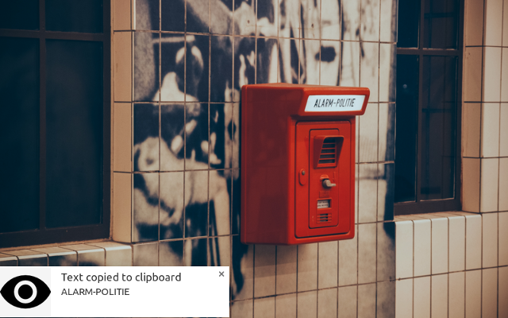
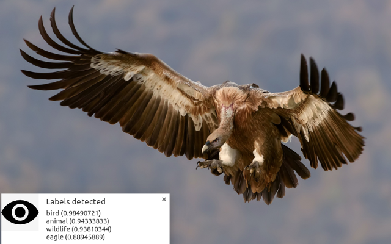

# Google Cloud Vision Chrome Extension example

This directory contains the code for the [Cloud Vision API]
(https://cloud.google.com/vision/) Chrome extension available [in the Chrome
webstore]
(https://chrome.google.com/webstore/detail/cloud-vision/nblmokgbialjjgfhfofbgfcghhbkejac).

This extension adds a right-click context menu to images in Chrome, with options
to run text detection, label detection or face detection on the image.

## Setup

To use this extension using your own API key, rename `config.json-EXAMPLE` to
`config.json` and specify your API key.

## Screenshots

Right-click an image and select "Cloud Vision" to show available options.

Select "Text detection" to detect text in the image, and have detected text copied to the clipboard.

Select "Label detection" to detect labels for the image, displayed in a browser notification.

Select "Face detection" to open a new tab with detected faces highlighted.

